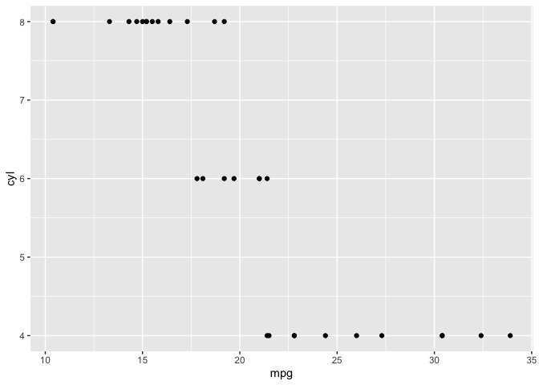

test\_Rscript.R
================
pedersl2
2020-01-27

``` r
<<<<<<< HEAD
library(ggplot2)

=======
>>>>>>> 6a8000289f7b49e29d860581c04ac9e634633960
# Given this function, use `trace()` to add a `browser()` statement before the
# stop
# Hint: Use as.list(body(fun)) and [[c(1, 2, 3)]] to descend into the expression
# tree.
fun <- function() {
  for (i in 1:10000) {
    if (i == 9876)
      print('hej')
  }
}

x <- as.list(body(fun))
x
```

    ## [[1]]
    ## `{`
    ## 
    ## [[2]]
    ## for (i in 1:10000) {
    ##     if (i == 9876) 
    ##         print("hej")
    ## }

``` r
as.list(x[[2]])
```

    ## [[1]]
    ## `for`
    ## 
    ## [[2]]
    ## i
    ## 
    ## [[3]]
    ## 1:10000
    ## 
    ## [[4]]
    ## {
    ##     if (i == 9876) 
    ##         print("hej")
    ## }

``` r
as.list(x[[c(2, 4)]])
```

    ## [[1]]
    ## `{`
    ## 
    ## [[2]]
    ## if (i == 9876) print("hej")

``` r
<<<<<<< HEAD
ggplot(mtcars, aes(mpg, cyl))+
  geom_point()
```

<!-- -->

``` r
=======
>>>>>>> 6a8000289f7b49e29d860581c04ac9e634633960
as.list(x[[c(2, 4, 2)]])
```

    ## [[1]]
    ## `if`
    ## 
    ## [[2]]
    ## i == 9876
    ## 
    ## [[3]]
    ## print("hej")

``` r
as.list(x[[c(2, 4, 2, 3)]])
```

    ## [[1]]
    ## print
    ## 
    ## [[2]]
    ## [1] "hej"
